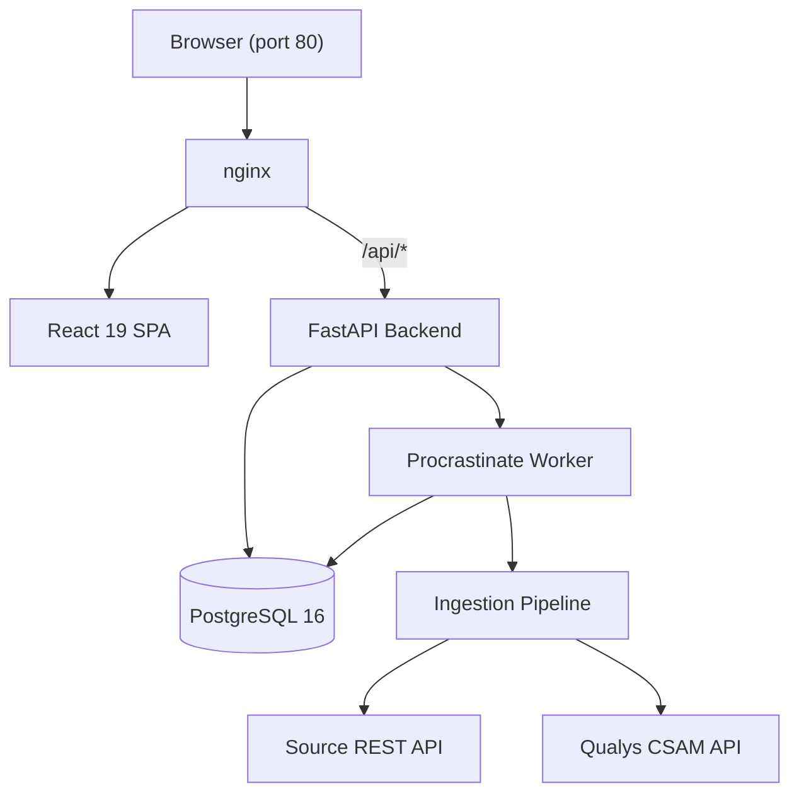
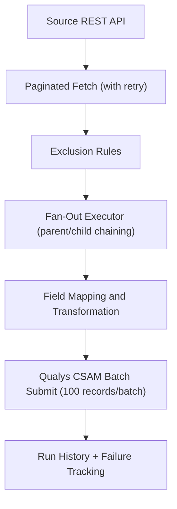

# Architecture

## System Overview

The platform runs as three Docker containers with a PostgreSQL database.



## Data Flow

The ingestion pipeline processes records through a series of stages before submitting them to Qualys.



Runs are triggered manually via the UI or API, or automatically via Procrastinate scheduled tasks.

## Tech Stack

### Backend

| Component | Technology |
|-----------|-----------|
| Framework | FastAPI (Python 3.12) |
| Database | PostgreSQL 16 (via SQLAlchemy ORM) |
| Migrations | Alembic |
| Task Queue | Procrastinate (PostgreSQL-backed) |
| HTTP Client | httpx (async) |
| Auth | JWT + Argon2 password hashing |
| Encryption | Fernet (cryptography library) |
| Qualys API Client | Custom `qualys_client` package |

### Frontend

| Component | Technology |
|-----------|-----------|
| Framework | React 19 |
| Build Tool | Vite |
| Styling | Tailwind CSS |
| Components | Radix UI |
| State/Data | TanStack React Query |
| Canvas | React Flow (visual node-based editor) |
| Routing | React Router v6 |

### Infrastructure

| Component | Technology |
|-----------|-----------|
| Containerization | Docker + Docker Compose |
| Reverse Proxy | nginx 1.27 |
| Database | PostgreSQL 16 (Docker volume) |

## Backend Layer Structure

```text
backend/app/
  routers/          # HTTP endpoints (thin handlers)
  services/         # Business logic (ingestion, auth, transforms)
  models/           # SQLAlchemy ORM models
  schemas/          # Pydantic request/response validation
  core/             # Settings, security, error handling
  db/               # Session factory, Alembic migrations
  worker/           # Procrastinate task queue integration
```

## Database Schema

| Table | Purpose |
|-------|---------|
| `connectors` | Connector configuration (name, base URL, auth method, encrypted credentials) |
| `connector_endpoints` | API endpoint paths with pagination config and data root |
| `canvases` | Named data flows grouping endpoints for a connector |
| `canvas_endpoints` | Join table linking endpoints to canvases with parent/child relationships |
| `field_mappings` | Source-to-target field mapping rules per endpoint |
| `qualys_config` | Qualys CSAM subscription credentials (singleton) |
| `users` | User accounts with role assignment |
| `roles` | Custom roles with name, description, and system flag |
| `role_permissions` | Permission strings assigned to roles (`resource:action` format) |
| `run_history` | Ingestion run records with aggregate statistics |
| `run_failures` | Per-record failure details linked to a run |
| `endpoint_run_logs` | Per-endpoint execution details within a run |
| `run_events` | Pipeline event timeline entries for diagnostic inspection |

### Key Relationships

- A **Connector** has many **Endpoints** and many **Canvases**.
- A **Canvas** groups endpoints via **CanvasEndpoints** (with parent/child tree structure).
- **FieldMappings** are scoped to an endpoint (and optionally a canvas).
- **RunHistory** links to a connector; each run produces **EndpointRunLogs**, **RunFailures**, and **RunEvents**.
- **Users** are assigned to **Roles**; **Roles** hold **RolePermissions**.

## Task Queue

The platform uses Procrastinate as its task queue, backed by PostgreSQL.

- The app singleton uses `PsycopgConnector` with the project `DATABASE_URL`.
- Two queues: `syncs` (connector runs) and `default` (poller).
- Polling: `poll_due_schedules` runs every 60 seconds via a periodic cron task.
- Retry: 3 attempts, 30-second wait, linear backoff.
- Overlap protection: `queueing_lock` and `lock` per connector ID prevent duplicate runs.
- Procrastinate uses its own PostgreSQL schema (`procrastinate`).

## Security Model

All credentials (source API tokens, Qualys passwords) are **Fernet-encrypted** at rest.
API responses use boolean flags (`has_token`, `has_password`) instead of returning secrets.

### Authentication

- JWT access tokens expire after 15 minutes.
- Refresh tokens expire after 7 days.
- Passwords must be 12+ characters with 2+ numbers and 1+ special character.

### Role-Based Access Control (RBAC)

The platform uses a custom RBAC system with granular permissions.

- 7 resource areas: `connectors`, `canvases`, `schedules`, `runs`, `settings`, `users`, `roles`.
- 4 CRUD actions per area plus 2 special actions: `runs:trigger_sync` and `connectors:toggle_enabled`.
- Total: 30 permissions stored as `resource:action` strings in the `role_permissions` table.
- Roles are custom-created by administrators.
- System roles are marked with an `is_system` flag and cannot be modified.
- The permission matrix UI allows visual permission assignment per role.
- Each user is assigned exactly one role.
- New users have zero permissions until a role is assigned (least-privilege default).
