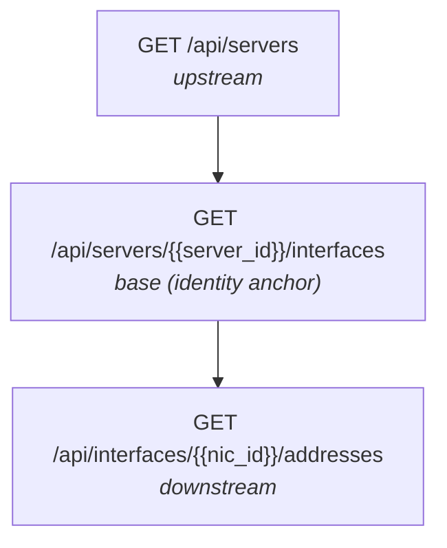

# Canvases and Endpoint Chaining

> **Workflow:** [[Creating a Connector|Connector]] > [[Endpoints and Field Discovery|Endpoints]] > **Canvas** > [[Field Mapping|Mapping]] > [[Scheduling|Schedule]]

A canvas organizes a connector's endpoints into a tree structure that defines how data flows during a sync. Each canvas produces one set of asset records for Qualys.

## How It Works

Before building a canvas, it helps to understand three concepts: endpoint roles, tree structure, and identity-anchored submission.

### Endpoint Roles

Every endpoint in a canvas tree has one of three roles:

- **Upstream** -- Parent endpoints that provide data and variable values to their children. They sit above the base in the tree.
- **Base (identity anchor)** -- The endpoint whose records determine the granularity of Qualys submissions. Each record from the base endpoint becomes one asset record. The base is auto-detected -- you do not set it manually.
- **Downstream** -- Child endpoints below the base that enrich records with additional fields. If a downstream endpoint fails, the pipeline continues with partial enrichment rather than failing the entire sync.

### Tree Structure

Endpoints form a parent-child tree. Root endpoints have no parent. Child endpoints use template variables (`{{var}}`) in their paths, resolved from parent endpoint fields via variable extractions.

For example, consider a CMDB with servers, network interfaces, and IP addresses:

In this example:
- **Servers** is upstream -- it provides the `server_id` variable and any mapped server-level fields.
- **Interfaces** is the base -- each interface record becomes one Qualys asset record.
- **Addresses** is downstream -- it enriches each interface record with IP address data.

### Identity-Anchored Submission

The base endpoint determines record granularity. The system detects the base automatically using BFS (breadth-first search) traversal: starting from the root endpoints, it examines each tree level (ordered by tree_order within each level) and selects the first endpoint that has at least one Qualys identity attribute mapped.

The 11 identity attributes are: `qualysAssetId`, `sourceNativeKey`, `instanceUuid`, `hostName`, `netBiosName`, `fqdn`, `macAddress`, `ipAddress`, `serialNumber`, `hardwareUuid`, `networkUuid`.

For details on how the pipeline assembles records from upstream, base, and downstream endpoints, see [[Architecture#Data Flow]].

> **Warning:** If multiple endpoints at the same tree level have identity fields mapped, the canvas is invalid due to ambiguity. Move identity mappings to a single endpoint at each level.

## Creating a Canvas

1. Open a connector and go to the **Canvases** tab.
2. Click **Create Canvas**.
3. Enter a canvas name and an optional description.
4. Click **Save** -- the canvas is created empty, ready for endpoints.

## Adding Endpoints to the Canvas

1. Open the canvas.
2. Click **Add Endpoint** -- this shows unassigned endpoints from this connector.
3. Select an endpoint -- it is added as a root node (no parent).

Only endpoints not already assigned to another canvas are shown.

## Building the Endpoint Tree

1. Add a child endpoint that uses template variables in its path (for example, `/api/servers/{{server_id}}/nics`).
2. Set the parent endpoint -- the endpoint whose response provides the variable values.
3. Configure **variable extractions** -- map each `{{variable}}` in the child's path to a field from the parent's response.
4. Optionally set **max concurrency** (default 5) to control how many parallel child requests are made per parent record.
5. Optionally configure **exclusion rules** to filter which parent records trigger child requests.

## Canvas Endpoint Settings

| Setting | Default | Description |
|---------|---------|-------------|
| Parent | (none) | Parent endpoint in the tree. Null = root endpoint. |
| Variable Extractions | (none) | Maps template variables to parent response fields. |
| Max Concurrency | 5 | Parallel child requests per parent record. |
| Exclusion Rules | (none) | Filter rules to skip certain parent records. |
| Tree Order | 0 | Controls BFS traversal order (affects base detection). |

## What's Next

With your canvas tree built, the next step is to map source fields to Qualys target fields on each endpoint.

[[Field Mapping]]
