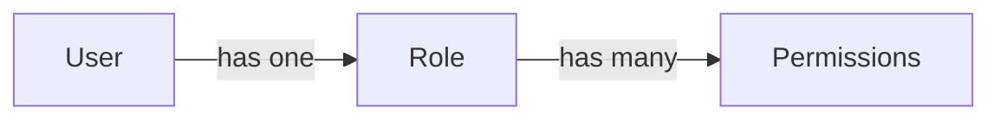

# User Management

This page covers roles, permissions, and user accounts. For technical details of authentication and token handling, see [[Architecture#Security Model]].

## How RBAC Works

The connector uses role-based access control (RBAC) to govern what each user can do. Every action -- whether triggered through the API or the web UI -- is checked against the user's permissions.

The permission model has three layers:

- Each **user** is assigned exactly one **role**.
- Each **role** contains a set of **permissions**.
- **Permissions** follow the `resource:action` format (for example, `connectors:read` or `runs:trigger_sync`).

Permissions are checked on every API call and control which UI elements are visible. If a user's role lacks a required permission, the action is blocked with a 403 Forbidden response.

There are **7 resource areas**: Connectors, Canvases, Schedules, Runs, Settings, Users, and Roles. Each resource area has 4 standard CRUD actions (create, read, update, delete), and two resource areas have an additional special action -- totalling **30 permissions**.

New roles start with zero permissions. You add permissions explicitly.

## Creating a Custom Role

1. Navigate to **Administration > Roles** in the sidebar.
2. Click **Create Role**.
3. Enter a role name (must be unique) and an optional description.
4. Click **Save** -- the role is created with zero permissions.

The role exists but cannot do anything yet. The next step is to assign permissions.

## Assigning Permissions

1. Open the role you just created (or any custom role).
2. The permission matrix shows a grid: rows are resource areas, columns are actions.
3. Check the permissions you want to grant.
4. Click **Save**.

Two resource areas include special actions beyond standard CRUD:

- **Connectors** includes `toggle_enabled` -- enable or disable a connector without needing full update access.
- **Runs** includes `trigger_sync` -- manually trigger a sync run without needing create access to run records.

## Creating a User

1. Navigate to **Administration > Users**.
2. Click **Create User**.
3. Enter the user's email address.
4. Select the role to assign.
5. Click **Create**.
6. The system generates a temporary password and displays it once.

> **Warning:** Copy the temporary password immediately. It cannot be retrieved after you close this dialog.

7. Share the temporary password with the user through a secure channel.

## Managing Passwords

### First Login

1. The user logs in with their email and the temporary password.
2. The system redirects to the password change screen.
3. The user must set a new password before accessing any other feature.

### Password Policy

| Rule | Requirement |
|------|-------------|
| Minimum length | 12 characters |
| Numeric digits | At least 2 |
| Non-alphanumeric | At least 1 (e.g., `!@#$%^&*`) |

### Changing Your Password

Users can change their password at any time from **Profile** in the sidebar.

## Deactivating a User

1. Navigate to **Administration > Users**.
2. Find the user and click **Deactivate**.
3. Deactivated users cannot log in and any active sessions are revoked.

Users are deactivated, not deleted. This preserves run history attribution.

## Built-in Roles

### Administrator

- Has all 30 permissions granted automatically.
- Cannot be modified or deleted (system-protected).
- In the permission matrix, all checkboxes appear checked and disabled.

### Last-Admin Protection

Three safeguards prevent locking yourself out of the system:

1. **Self-deactivation blocked** -- you cannot deactivate your own account.
2. **Last admin deactivation blocked** -- you cannot deactivate the last active user with the Administrator role.
3. **Last admin role reassignment blocked** -- you cannot reassign the last administrator to a different role.

## Permission Reference

### Connectors

| Permission | Grants |
|------------|--------|
| connectors:create | Create new connectors and configure their authentication |
| connectors:read | View connector list and details |
| connectors:update | Edit connector settings and authentication |
| connectors:delete | Remove connectors and their associated data |
| connectors:toggle_enabled | Enable or disable a connector |

### Canvases

| Permission | Grants |
|------------|--------|
| canvases:create | Create new canvases and link endpoints |
| canvases:read | View canvas list, details, and field mappings |
| canvases:update | Edit canvas configuration and endpoint assignments |
| canvases:delete | Remove canvases |

### Schedules

| Permission | Grants |
|------------|--------|
| schedules:create | Create sync schedules for connectors |
| schedules:read | View schedule list and configuration |
| schedules:update | Edit schedule timing and enable/disable toggle |
| schedules:delete | Remove schedules |

### Runs

| Permission | Grants |
|------------|--------|
| runs:create | Create run records (system use) |
| runs:read | View run history, status, and diagnostic payloads |
| runs:update | Update run metadata (system use) |
| runs:delete | Remove run history records |
| runs:trigger_sync | Manually trigger a sync run |

### Settings

| Permission | Grants |
|------------|--------|
| settings:create | Create application settings |
| settings:read | View Qualys configuration and application settings |
| settings:update | Modify Qualys credentials and application settings |
| settings:delete | Remove application settings |

### Users

| Permission | Grants |
|------------|--------|
| users:create | Create new user accounts |
| users:read | View user list and details |
| users:update | Edit user details and reset passwords |
| users:delete | Deactivate user accounts |

### Roles

| Permission | Grants |
|------------|--------|
| roles:create | Create custom roles |
| roles:read | View role list and assigned permissions |
| roles:update | Edit role name, description, and permissions |
| roles:delete | Remove custom roles (not system roles) |

## What's Next

- [[Creating a Connector]] -- Set up your first data source
- [[Scheduling]] -- Automate recurring syncs
- [[Architecture#Security Model]] -- Technical details of authentication and authorization

Having trouble? See [[Troubleshooting]].
